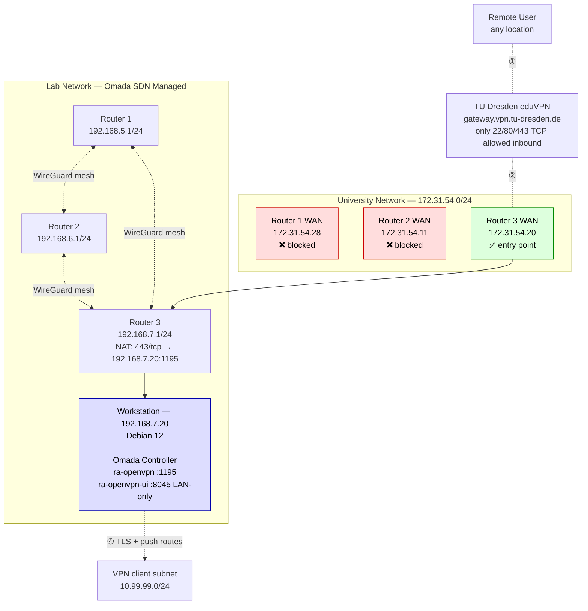
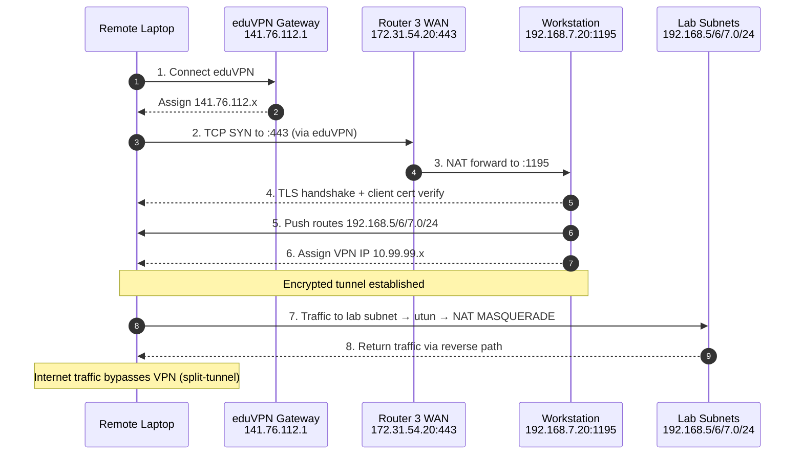

# RA OpenVPN — Containerized Remote Access VPN for the Isolated QCNets Lab

A production-grade, split-tunnel OpenVPN deployment integrated with a TP-Link Omada SDN-managed multi-router network. Built for an isolated research lab that must be reachable remotely by team members through eduVPN.

**Environment:** Debian 12 workstation | Docker Compose | 3-router Omada SDN mesh (WireGuard site-to-site) | TU Dresden eduVPN for the outer transit hop.

---

## Table of Contents

1. [Overview](#overview)
2. [Screenshots](#screenshots)
3. [Architecture](#architecture)
5. [Prerequisites](#prerequisites)
6. [Quickstart](#quickstart)
7. [User Onboarding](user-onboarding/README.md)
8. [Configuration](#configuration)
9. [Operations](#operations)
10. [Security](#security)
11. [Troubleshooting](#troubleshooting)
12. [Design Decisions](#design-decisions)
13. [Roadmap](#roadmap)
14. [License](#license)

---

## Overview

The QCNets lab operates a three-router network segmented into `192.168.5.0/24`, `192.168.6.0/24`, and `192.168.7.0/24`, connected by a WireGuard site-to-site mesh and managed centrally through an Omada SDN Controller. Team members need to reach this network remotely for development, testing, and SDN administration.

**This project delivers:**

- A dockerized, TCP-based OpenVPN server on the lab's workstation
- Web-UI-driven certificate lifecycle management
- Full SDN-integrated network entry (NAT-forwarded through a TP-Link Omada gateway)
- Split-tunnel design — remote users retain their normal internet path
- Env-driven configuration with schema-based pre-flight validation
- Reproducible from a clean host in under 10 minutes

**End result:** a remote user connects to eduVPN, then to this OpenVPN, and gains authenticated access to all three lab subnets as if physically present.

---

## Screenshots

> **TODO:** Insert:
> - Omada Controller dashboard showing 3 routers as Connected
> - OpenVPN client `Initialization Sequence Completed` output
> - OpenVPN UI certificates page (via SSH tunnel)
> - `ping 192.168.5.1` success from a remote laptop after connection

---

## Architecture

### Topology


---

### Traffic Flow



**Why Router 3 (not Router 1)?** During deployment, I discovered that the university's edge firewall permits inbound TCP only to `172.31.54.20` on ports 22/80/443. The other two router WAN IPs are silently dropped despite being on the same subnet and having identical NAT configurations. Root cause identified as per-destination-IP filtering at the university edge, unrelated to our router configuration or SDN mode. Router 3 was originally used by a colleague's OpenVPN, which I consolidated into this deployment.

---

## Prerequisites

**Host:**
- Debian 12 or equivalent Linux
- Docker Engine + Compose plugin
- UFW firewall installed
- IPv4 forwarding capability

**Network:**
- One router with WAN reachable from the intended remote-access source
- Ability to add NAT/Port-Forwarding rules on that router (via Omada Controller or standalone admin)
- Optional but recommended: WireGuard mesh or similar interconnect between segmented LANs, so VPN clients reach all lab subnets

**Verify host readiness:**
```bash
sysctl net.ipv4.ip_forward         # → 1
docker --version                   # → 24.x+
docker compose version             # → v2.x
sudo ufw status                    # → active
ip -o link show | grep <your_lan>  # → LAN interface
```

---

## Quickstart

**1. Clone and enter project directory:**

```bash
sudo git clone https://github.com/ahmadjon-rajabov/ra-openvpn.git /opt/ra-openvpn
cd /opt/ra-openvpn
```

**2. Create your `.env` from the template:**

```bash
sudo cp .env.example .env
sudo chmod 600 .env
sudo chown root:root .env
sudo nano .env
```

Edit at minimum:
- `RA_OPENVPN_ADMIN_PASSWORD` — set a strong password
- `RA_OPENVPN_UI_BIND_LAN` — your workstation's LAN IP
- `RA_LAN_INTERFACE` — your host's LAN interface (e.g., `eno1`, `enp3s0`, `eth0`)
- `RA_UI_ALLOWED_SUBNETS` — LANs allowed to reach the Web UI

**3. Install the CLI symlinks:**

```bash
sudo chmod +x /opt/ra-openvpn/ra-*.sh
sudo ln -sf /opt/ra-openvpn/ra-ovpn.sh     /usr/local/bin/ra-ovpn
sudo ln -sf /opt/ra-openvpn/ra-validate.sh /usr/local/bin/ra-validate
sudo ln -sf /opt/ra-openvpn/ra-firewall.sh /usr/local/bin/ra-firewall
```

**4. Validate configuration:**

```bash
ra-validate
```

Expected: Validation passed — configuration looks great.

**5. Apply host firewall rules:**

```bash
sudo ra-firewall apply
```

**6. Start the stack:**

```bash
ra-ovpn up
ra-ovpn logs ra-openvpn      # follow logs; watch for PKI generation
```

**7. Configure the router entry point (external NAT):**

On your router's admin UI or SDN Controller, add:

| Field | Value |
|---|---|
| External Port | `443` (or any port you have open) |
| Internal IP | Your workstation IP (e.g., `192.168.7.20`) |
| Internal Port | `1195` (matches `RA_OPENVPN_HOST_PORT`) |
| Protocol | TCP |

**8. Create the first user via Web UI:**

```bash
# From your laptop, SSH-tunnel to reach the UI
ssh -L 8045:192.168.7.20:8045 user@172.31.54.20
```

Then browse to `http://localhost:8045`. Login → Certificates → New → download `<user>.ovpn`.

**9. Onboard clients:**

Distribute the [`user-onboarding/`](user-onboarding/) folder together with each user's `.ovpn` file. Setup instructions for Windows, macOS, and Linux live in [`user-onboarding/README.md`](user-onboarding/README.md).

For a quick smoke test from the admin machine:

```bash
sudo openvpn --config <user>.ovpn
```

Watch for Initialization Sequence Completed, then in another terminal:

```bash
ping -c 3 192.168.5.1     # Router 1 LAN
curl -s ifconfig.me       # should still show your ISP IP (split-tunnel proof)
```

---

## Configuration

All runtime configuration lives in `/opt/ra-openvpn/.env`. The full schema is enforced by `ra-validate`.

### Environment Variables

| Variable | Type | Example | Purpose |
|---|---|---|---|
| `COMPOSE_PROJECT_NAME` | string | `ra-openvpn` | Docker Compose project prefix |
| `RA_OPENVPN_CONTAINER_NAME` | string | `ra-openvpn` | OpenVPN container name |
| `RA_OPENVPN_UI_CONTAINER_NAME` | string | `ra-openvpn-ui` | Web UI container name |
| `RA_OPENVPN_IMAGE` | image ref | `d3vilh/openvpn-server:0.5.5` | Pinned server image |
| `RA_OPENVPN_UI_IMAGE` | image ref | `d3vilh/openvpn-ui:0.9.5.6` | Pinned UI image |
| `RA_OPENVPN_HOST_PORT` | port | `1195` | Port on the host for OpenVPN |
| `RA_OPENVPN_CONTAINER_PORT` | port | `1194` | Port inside the container |
| `RA_OPENVPN_UI_CONTAINER_PORT` | port | `8080` | UI's internal port |
| `RA_OPENVPN_PROTO` | protocol | `tcp` | TCP required (UDP blocked upstream) |
| `RA_OPENVPN_UI_BIND_LOCAL` | ip | `127.0.0.1` | Localhost binding for SSH-tunnel access |
| `RA_OPENVPN_UI_BIND_LAN` | ip | `192.168.7.20` | LAN binding for lab-network access |
| `RA_OPENVPN_UI_PORT` | port | `8045` | Web UI port |
| `RA_OPENVPN_ADMIN_USERNAME` | string | `admin` | Web UI admin username |
| `RA_OPENVPN_ADMIN_PASSWORD` | secret | *strong password* | Web UI admin password |
| `RA_TRUST_SUB` | cidr | `10.0.0.0/8` | Trusted subnet (image env var) |
| `RA_GUEST_SUB` | cidr | `172.16.0.0/12` | Guest subnet (image env var) |
| `RA_HOME_SUB` | cidr | `192.168.0.0/16` | Home subnet (image env var) |
| `RA_VPN_CLIENT_SUBNET` | cidr | `10.99.99.0/24` | VPN client address pool |
| `RA_LAN_INTERFACE` | iface | `eno1` | Host LAN interface for NAT masquerade |
| `RA_UI_ALLOWED_SUBNETS` | string | `"192.168.5.0/24 …"` | LANs permitted to reach UI |
| `RA_DOCKER_NET_NAME` | string | `ra_openvpn_net` | Internal Docker bridge name |
| `RA_DOCKER_NET_SUBNET` | cidr | `172.20.0.0/24` | Internal Docker bridge subnet |
| `RA_RESTART_POLICY` | string | `unless-stopped` | Docker restart policy |

### Server Configuration

The OpenVPN server config lives at `/opt/ra-openvpn/server.conf`. It's bind-mounted read-only into the container to prevent UI-side overwrites. Key settings:

- **Transport:** TCP on port 1194 (mapped to host 1195)
- **VPN subnet:** `10.99.99.0/24` (must match `RA_VPN_CLIENT_SUBNET`)
- **Data ciphers:** `AES-256-GCM:AES-128-GCM:CHACHA20-POLY1305`
- **Control channel:** SHA256 + TLS 1.2 minimum + tls-crypt
- **Pushed routes:** `192.168.5/6/7.0/24` (split-tunnel)
- **Client-to-client:** disabled by default
- **Management interface:** `0.0.0.0:2080` inside the container (used by the UI)

Edit `server.conf` on the host, then `ra-ovpn restart`.

---

## Operations

Three custom shell scripts manage the deployment. All are idempotent and safe to re-run.

### `ra-ovpn` — Stack Lifecycle

```
Usage: ra-ovpn <command> [--no-validate]
```

Commands: 
- `up` Validate + start the stack 
- `down` Stop and remove containers (preserves volumes) 
- `restart` Validate + restart both containers 
- `logs` [svc] Follow logs (svc: ra-openvpn | ra-openvpn-ui) 
- `status` Show container status validate Run pre-flight validation only
- `pull` Pull latest images update Validate + pull + restart shell [svc] Open shell in a container 
- `dir` Print the project directory 
- `help` Show help

Auto-validates before `up`, `restart`, and `update` (skip with `--no-validate` for advanced use).

### `ra-validate` — Pre-flight Configuration Check

Schema-driven validation with four steps:

1. **File presence** — `.env`, `docker-compose.yaml`, `server.conf` exist
2. **Variable presence** — every schema variable set and non-empty
3. **Type validation** — port ranges, CIDR notation, existing interface, non-placeholder secrets
4. **Compose parseability** — `docker compose config -q` clean parse

Exit codes: `0` = pass, `1` = validation failure, `2` = script setup problem.

Supported types: `port`, `protocol`, `cidr`, `ip`, `iface`, `secret`, `image`, `string`.

### `ra-firewall` — Host Firewall Manager

```
Usage: sudo ra-firewall <apply|remove|status>
```

Applies (or removes) all firewall infrastructure this project requires:

1. **Inbound TCP** on `RA_OPENVPN_HOST_PORT` from any source
2. **Inbound TCP** on `RA_OPENVPN_UI_PORT` from `RA_UI_ALLOWED_SUBNETS` only
3. **NAT masquerade** for `RA_VPN_CLIENT_SUBNET` → `RA_LAN_INTERFACE` (tagged block in `/etc/ufw/before.rules`)
4. **Enables IPv4 forwarding** persistently via `/etc/sysctl.d/99-ra-openvpn.conf`
5. **Sets** `DEFAULT_FORWARD_POLICY=ACCEPT` in `/etc/default/ufw`

All rules are tagged with `ra-openvpn` comments for auditability. `ra-firewall remove` cleanly reverses everything.

---

## Security

### PKI

- **CA private key** lives in `pki/private/ca.key` (never leaves the host)
- **Server cert/key** bind-mounted read-only into container
- **Client keys** generated inside container; inline versions embedded in `.ovpn` files
- **CRL** regenerated on revocation
- All PKI directory contents excluded from git

### Web UI Binding Model

- The UI is bound to exactly two addresses: `127.0.0.1:8045` → local-only access (SSH tunnel required from remote) `192.168.7.20:8045` → lab LAN access (from any host in `192.168.7.0/24`)
- **Deliberately not** bound to `0.0.0.0` — so VPN clients (arriving via `tun0`) **cannot** reach the UI. Administrative access requires either SSH into the workstation (with credentials) or physical presence on the lab LAN. This is a defense-in-depth boundary against compromised VPN clients.

### Split-Tunnel Design

Only `192.168.5.0/24`, `192.168.6.0/24`, and `192.168.7.0/24` are pushed to clients. The client's default gateway is unchanged — internet traffic doesn't flow through the VPN.

**Benefits:**
- Coexists with the user's eduVPN (or any other VPN)
- Doesn't consume bandwidth on the lab uplink
- User privacy preserved (their web browsing doesn't traverse lab infrastructure)

### Modern Crypto
- **Data channel:** AEAD ciphers only — `AES-256-GCM`, `AES-128-GCM`, `CHACHA20-POLY1305`
- **Control channel:** SHA256 HMAC + TLS 1.2 minimum
- **tls-crypt** wrapping the control channel (harder to fingerprint, resistant to active probing)
- **Client cert required** (`verify-client-cert require`) — no username/password fallback

### Secrets Management

- `.env` is `chmod 600`, owned by root, excluded from git
- PKI files (`pki/`), UI database (`db/`), client `.ovpn` files, and IP-persistence file (`config/ipp.txt`) all excluded from git
- Only `.env.example` (with placeholder values) is committed

---

## Troubleshooting

### Reachability Diagnostics

```bash
# From your remote laptop with eduVPN active
nc -vz -w 5 <router_wan_ip> 443

#Expected outcomes:
succeeded → router forwarding to workstation, OpenVPN listening
refused → router reached, port not forwarded (add NAT rule)
timed out → packets dropped upstream (firewall or blocked IP)
```

### OpenVPN Connection Fails

```bash
# On workstation, watch server logs during client connect
ra-ovpn logs ra-openvpn

# Check that OpenVPN is listening
sudo ss -tlnp | grep 1195

# Check container health
ra-ovpn status
```

### After Tunnel Established, No Lab Access

```bash
# On workstation
sudo iptables -t nat -L POSTROUTING -n | grep 10.99.99
# Should show MASQUERADE rule for 10.99.99.0/24 out via eno1

sysctl net.ipv4.ip_forward
# Should be 1
```
If either check fails: `sudo ra-firewall apply`.

---

## Design Decisions

|Decision       |Choice | Rationale |
|---------------|---------------------------------------------|-------------------------------------------------------|
|Container base |`d3vilh/openvpn-server` + `d3vilh/openvpn-ui`|Actively maintained, Web UI included, sensible defaults|
|Location       |Workstation container                        |Central management; same host runs Omada Controller    |
|Transport      |TCP-only                                     |UDP blocked outbound at university firewall            |
|External port  |443/tcp                                      |Only 22/80/443 TCP allowed inbound to lab subnet       |
|VPN subnet     |`10.99.99.0/24`                              |Distinctive; unlikely home-network conflict            |
|Tunneling      |Split-tunnel                                 |Coexists with eduVPN; better UX for users              |
|Config approach|Env-driven with schema validation            |Single source of truth, no hardcoded values            |
|UI exposure    |Localhost + lab LAN only                     |Defense-in-depth against compromised VPN client        |
|Router entry   |Omada SDN NAT rule                           |Centrally managed; audit trail; no per-router logins   |
|PKI            |Container-managed EasyRSA                    |No manual cert management; UI-driven lifecycle         |
|Restart policy |`unless-stopped`                             |Survives host reboot; won't restart after manual stop  |

---

## Roadmap

Short-term:
- Triple-remote client .ovpn template (Routers 1, 2, 3 for failover) — pending IT whitelist for Routers 1 & 2
- Server certificate CN distinct from CA CN (cosmetic; via easyrsa build-server-full --req-cn)
- Backup/restore automation (ra-ovpn backup and restore commands)
- ra-seed.sh — SQL-driven UI database initialization for fully-idempotent container recreation

Medium-term:
- Non-admin UI user for daily cert management (separate from full admin)
- HTTPS reverse proxy in front of the UI (nginx + Let's Encrypt)
- Per-user access controls via client-config-dir + iptables (restrict specific users to specific subnets)

Long-term:
- Prometheus exporter for OpenVPN metrics
- GitHub Actions CI running ra-validate on PRs
- Migration to public IP or DDNS to remove WAN-IP tracking dependency

---

## License
MIT License — see LICENSE file.